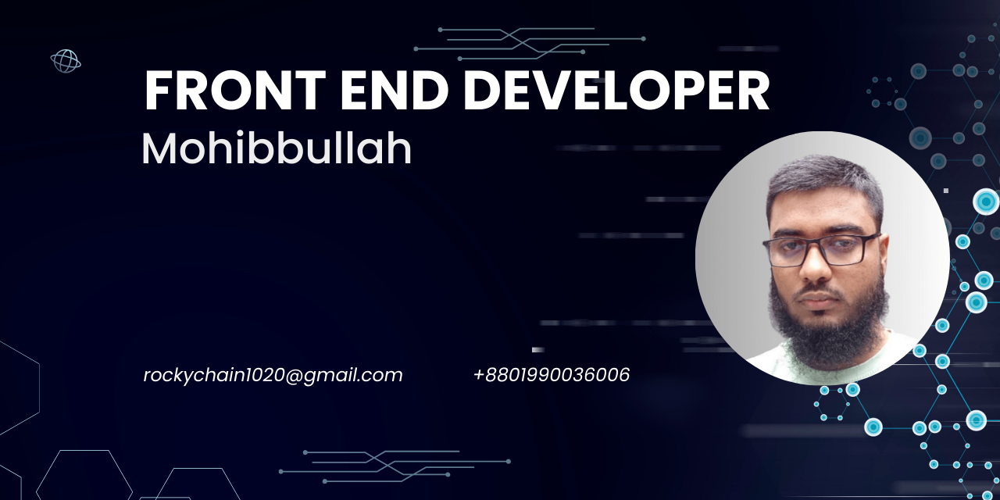
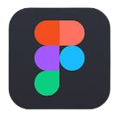
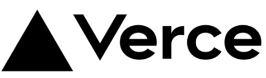

<h1 align='center'>

Hi, I am Mohibbullah
 
A full-time front-end developer

</h1>
<!-- description -->

Hello, I'm Mohibbullah, a committed and enthusiastic React front-end developer with expertise in full-stack development. In the last six months, I've focused on refining my web development skills, specializing in React.js for front-end tasks. Additionally, I have knowledge of Express.js for server-side development and MongoDB for database management. This enables me to handle end-to-end development tasks, contributing to the creation of robust and scalable web applications.

 
- 🌱 I’m currently learning **Redux,Next Js**

- 💬 Ask me about **React**

- 📫 How to reach me **rockychain1020@gmail.com**

- 📄 Know about my experiences [my-resume](https://drive.google.com/drive/folders/1smdE1E5R7djV0kn5UbnlWAyDSnv_Z5mL)

 

<!-- my ------ -->
<!-- 

 -->

<!-- my skills -->

## My Skill Set

<!-- fron end teachnology ------------------------ -->
<table><tr><td valign="top" width="33%">

### Frontend

<!-- back end teachnology ------------------------ -->
</td><td valign="top" width="33%">

### Backend

 

<!-- Uses tools ------------------------ -->
</td><td valign="top" width="33%">

### Tools

 

</td></tr></table>
 

<!-- social icon and link -->
## Connect With Me

<!--
**Mohibbulla-MMM/Mohibbulla-MMM** is a ✨ _special_ ✨ repository because its `README.md` (this file) appears on your GitHub profile.

  -->
